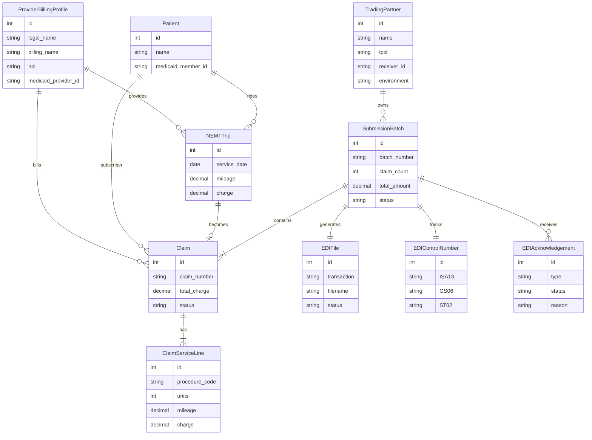
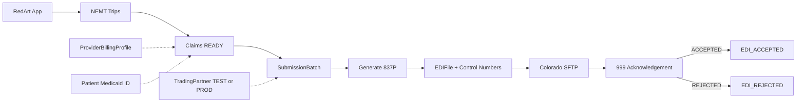

# RedArt EDI — Client Diagrams

These diagrams match the planned Colorado Medicaid 837P models.
Open this file on GitHub or any Mermaid viewer (no FigJam login needed).

## 1) Data model (entities)

## 2) Claim flow (Ali example)

## 3) Sample story for the client

| Step | Example |
|------|---------|
| Patient | Ali Khan — Medicaid ID `987654321` |
| Provider | Al Shifa Transportation — NPI `1234567890` |
| Trips | 3 rides (Aug 25–27), $50 each |
| Batch | `RB-2026-10048` — 3 claims — $150 |
| File | `123456789-837P-...-1of1.txt` |
| Next | Upload → Colorado 999 ACCEPTED / REJECTED |

## Important separation

- **TradingPartner** = EDI submitter (RedArt / clearinghouse role)
- **ProviderBillingProfile** = transportation company billing identity
- These must stay different in the 837P file
